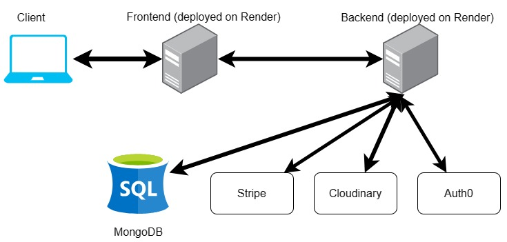

# Food Ordering System App

## Website Demo
https://restaurant-ordering-app-frontend.onrender.com/

## Skills
- Typescript, Javascript
- Reactjs
- TailwindCSS, HTML/CSS
- Nodejs
- MongoDB

## Features
- User authentication / Registration / Edit Profile
- Search restaurants / Sort restaurants /Filter restaurants
- Shopping Cart / Checkout
- Support Mobile and Desktop views

## Platforms
Render - Deploy frontend static web and backend server
Stripe - Support test checkout 
Cloudinary - Storing images

## FullStack Website Structure

